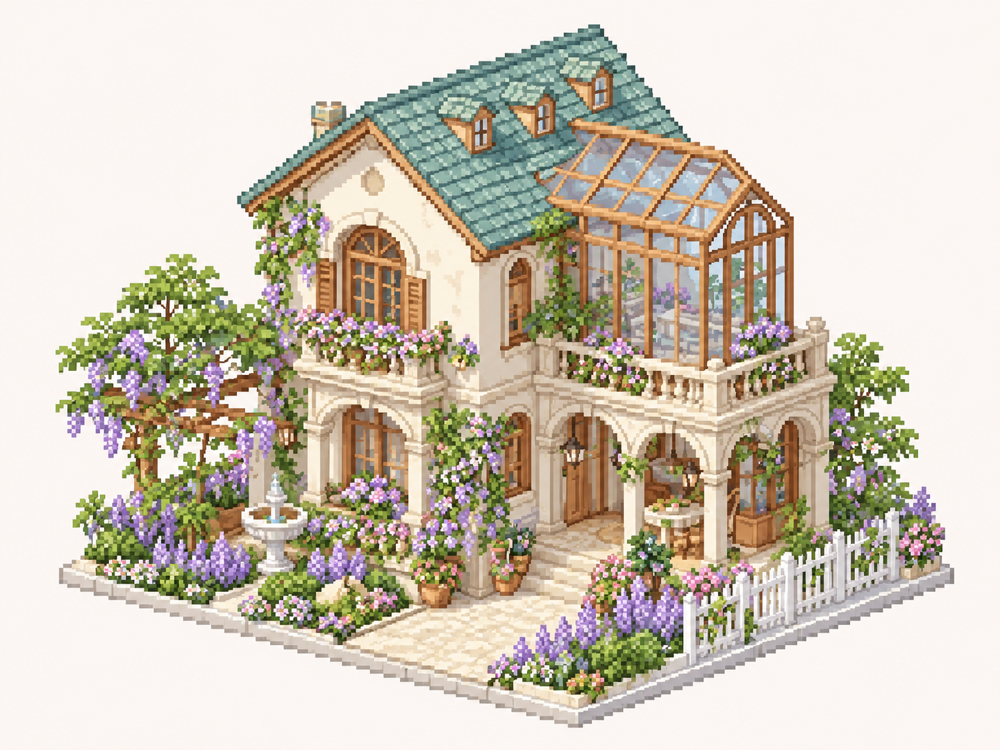
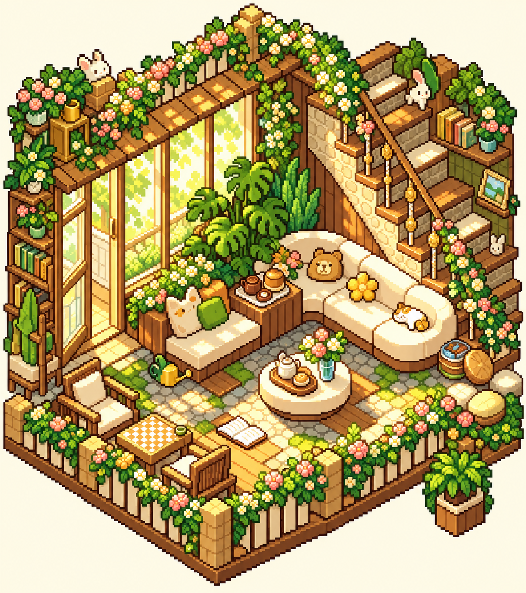
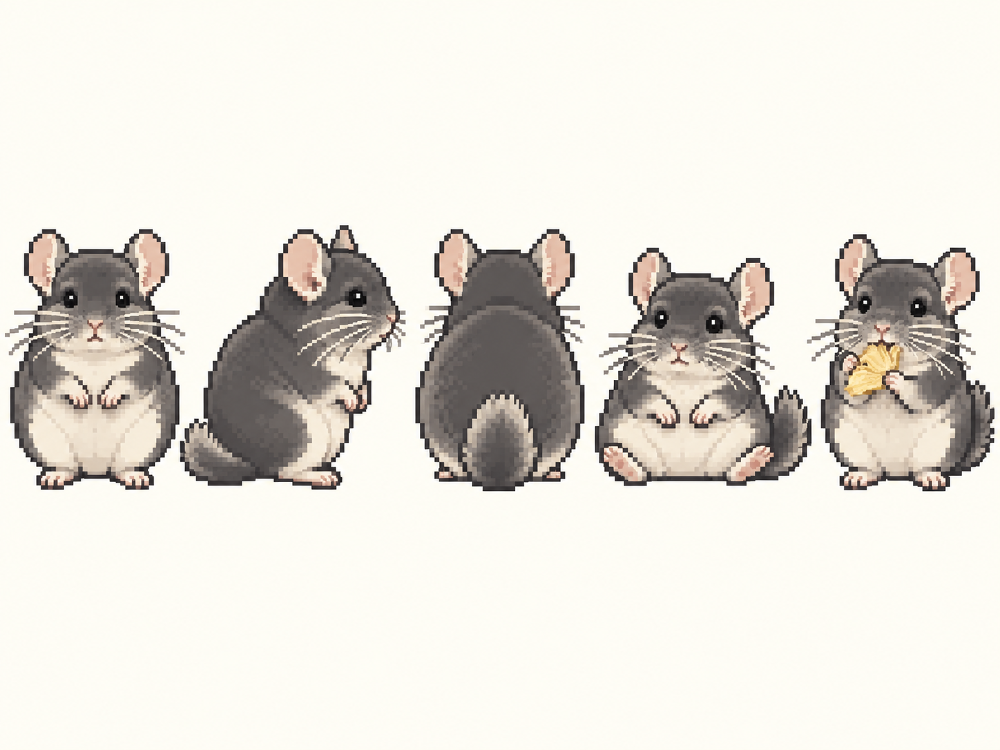
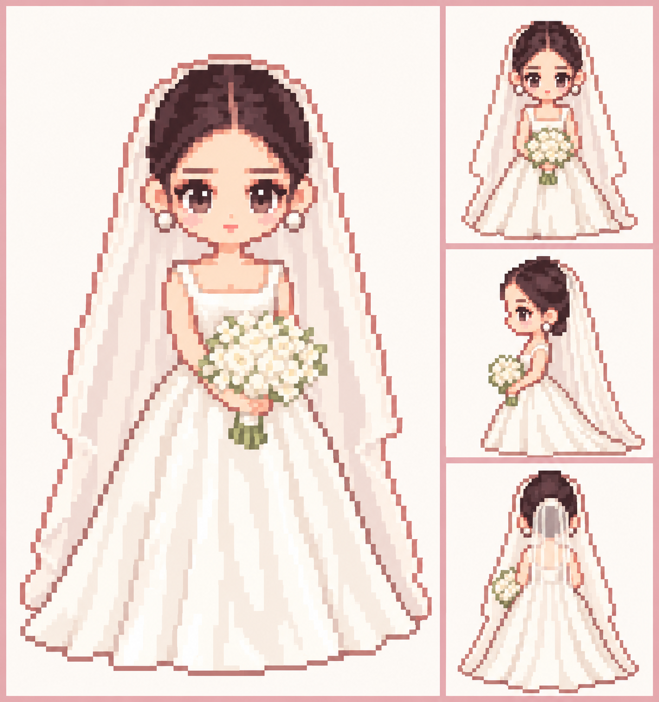
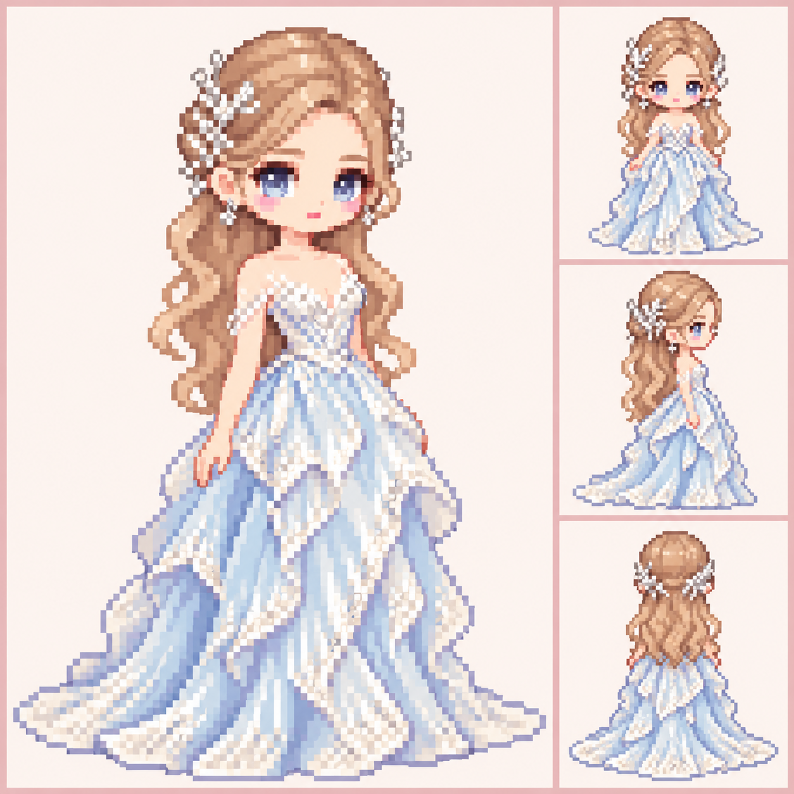

[English](#english) | [简体中文](#简体中文)

# Pikatang Pixel Art Generator

**Author: [JadeYui07](https://github.com/JadeYui07)**

## English

A Codex skill for planning, generating, revising, and organizing cozy Pikatang-inspired pixel art from written briefs or image references. It supports chibi characters and turnarounds, pets, house exteriors, interiors, furniture, and icons.

### Pixel Asset Workbench

- Choose a workflow for characters, pets, houses, interiors, furniture, icons, or coordinated asset packs.
- Create full-body character sheets, turnarounds, pose sets, and meaningful visual variations.
- Keep recurring characters and related asset sets visually consistent with references and shared style guidance.
- Organize and hand off requested outputs with descriptive filenames; resize or compress only when requested.
- Generate through the image-generation tools available in the current environment, or use the bundled Gemini API script. [SpriteCook](https://www.spritecook.ai/) is an optional backend when its MCP tools or API are separately configured; this skill does not install or connect SpriteCook. See [SpriteCook compatibility](references/spritecook.md), the [API docs](https://www.spritecook.ai/api-docs), and the [agent setup guide](https://www.spritecook.ai/agents).

### Optional pixel cleanup and Aseprite

Use the [Perfect Pixel adapter](references/pixel-cleanup.md) for local grid detection and resampling after generation. It is an optional, separately installed dependency; no upstream code or credentials are bundled. The adapter preserves the source and rejects transparent images rather than dropping alpha. Actual output dimensions can differ from a suggested grid.

Then follow the [Aseprite handoff](references/aseprite.md): open the PNG, save an editable `.aseprite`, refine pixels and manually build layers or animation frames. Aseprite must be installed separately. A generated PNG does not contain editable component layers or a ready-made animation. See [third-party notices](THIRD_PARTY_NOTICES.md).

### Character style

Character art uses a clear low-resolution game-sprite look: chunky square-pixel clusters, stepped silhouettes, compact chibi proportions, expressive faces, and soft pastel palettes. A character reference sheet can place a detailed full-body hero sprite on the left with front, side, and back views on the right. Text, watermarks, and game UI from reference screenshots are excluded unless requested.

### Examples

These AI-generated examples were made while trying the skill. Original reference photos and screenshots are not included.

| House | Garden room | Pet character sheet |
|---|---|---|
|  |  |  |

| Bride character sheet | Blue-gown character sheet |
|---|---|
|  |  |

### Install

Copy this repository folder into your Codex skills directory:

```text
~/.codex/skills/pikatang-pixel-art/
```

If you use a custom `CODEX_HOME`, install it under `$CODEX_HOME/skills/pikatang-pixel-art/`. The skill is available to Codex on the next turn.

### Generate with the bundled Gemini script

Requirements: Python 3 and a Gemini API key. The script uses Python's standard library.

Set the key in your shell (do not commit it):

```bash
export GEMINI_API_KEY="your-api-key"
```

Then run from the skill directory:

```bash
python3 scripts/generate_image.py \
  --prompt "A cozy pastel pixel-art room with a sunny window and plants" \
  --output "output/room.png" \
  --aspect-ratio "4:3" \
  --resolution "2K" \
  --reference "references/style-refs/iso-room-cozy.jpg"
```

Pass `--reference` more than once to include multiple local reference images. The default model is configured in `scripts/generate_image.py` and can be changed with `--model`.

### Typical workflow

1. Describe the subject or provide an image reference.
2. The skill infers the asset type, framing, and style consistency from the request; it asks only when a missing choice would materially change the output.
3. Generate images, then request focused revisions or organize the finished assets.

## 简体中文

这是一个 Codex skill，可根据文字描述或图片参考生成温暖、可爱的皮卡堂风格像素图。支持 Q 版人物立绘和多角度设定图、宠物、等距房间与家具，以及小物件图标。

### 像素素材工作台

- 按角色、宠物、房屋、室内、家具、图标或成套素材选择生成流程。
- 制作全身角色设定图、多角度图、动作组和有明确差异的视觉变体。
- 使用参考图和统一风格指导，保持同一角色及相关素材的视觉一致性。
- 按需整理文件名和交付素材；只有用户提出时才调整尺寸或压缩。
- 使用当前环境可用的图像生成工具，或运行内置 Gemini API 脚本。[SpriteCook](https://www.spritecook.ai/) 是可选后端，需要另行配置 MCP 工具或 API；此 skill 不会自动安装或连接 SpriteCook。详见 [SpriteCook 兼容说明](references/spritecook.md)、[API 文档](https://www.spritecook.ai/api-docs)和 [Agent 配置指南](https://www.spritecook.ai/agents)。

### 可选像素整理与 Aseprite

生成后可使用 [Perfect Pixel 调用脚本](references/pixel-cleanup.md)在本地检测网格、重新采样。依赖需要单独安装；本包不附带上游源码或账号密钥。脚本保留原图，并拒绝处理带透明度的图片以免丢失透明通道；实际尺寸可能与建议网格略有差异。

接着按 [Aseprite 配合流程](references/aseprite.md)打开 PNG、另存为 `.aseprite`，逐像素调整，并手动制作图层或动画帧。Aseprite 需要单独安装；生成的 PNG 不会自动带有部件图层或现成动画。详见[第三方声明](THIRD_PARTY_NOTICES.md)。

### 人物风格

人物图采用清晰的低分辨率游戏角色风格：明显的方块像素簇、阶梯轮廓、紧凑的 Q 版比例、富有表现力的面部，以及柔和的粉彩配色。角色设定图可以采用左侧精细全身主立绘、右侧正面/侧面/背面视图的布局。参考截图中的文字、水印和游戏 UI 默认不带入生成结果。

### 示例

以下为使用该 skill 测试时生成的 AI 示例图；未包含原始人物照片或参考截图。

| 房屋 | 花园房间 | 宠物角色设定图 |
|---|---|---|
|  |  |  |

| 新娘角色设定图 | 冰蓝礼服角色设定图 |
|---|---|
|  |  |

### 安装

将此仓库目录复制到 Codex skills 目录：

```text
~/.codex/skills/pikatang-pixel-art/
```

如果使用自定义 `CODEX_HOME`，请安装到 `$CODEX_HOME/skills/pikatang-pixel-art/`。Codex 会在下一轮识别该 skill。

### 使用内置 Gemini 脚本生成

需要 Python 3 和 Gemini API key；脚本使用 Python 标准库，无需额外安装 Python 依赖。

在终端设置 API key（不要提交到 GitHub）：

```bash
export GEMINI_API_KEY="your-api-key"
```

然后在 skill 目录中运行：

```bash
python3 scripts/generate_image.py \
  --prompt "阳光窗边、摆满绿植的温馨粉彩像素房间" \
  --output "output/room.png" \
  --aspect-ratio "4:3" \
  --resolution "2K" \
  --reference "references/style-refs/iso-room-cozy.jpg"
```

可以重复传入 `--reference` 来提供多张本地参考图。默认模型配置在 `scripts/generate_image.py` 中，也可用 `--model` 指定其他模型。

### 常见流程

1. 描述主题，或提供图片参考。
2. skill 根据请求推断素材类型、构图和风格一致性；只有缺少的信息会实质影响结果时才追问。
3. 生成图片，再按需提出针对性修改或整理素材。

## Attribution / 署名

Created by **[JadeYui07](https://github.com/JadeYui07)**.

## License / 许可证

MIT. See [LICENSE](LICENSE).

MIT 许可证，详见 [LICENSE](LICENSE)。
